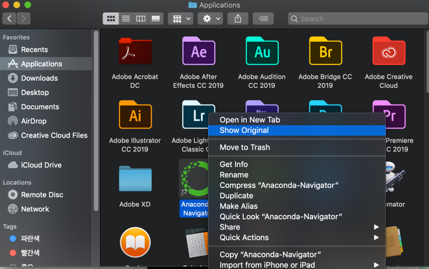

# PyQt5
- Can't use for commercial product for free(use PySide2 for free)


# PySide6
- free version of PyQt5
- https://wiki.qt.io/Qt_for_Python


## Install

```shell
pip install PyQt5
pip install PySide6
```

## Qt Designer

### Use Qt Designer of Anaconda
- Anaconda Navigator -> show original -> bin -> Designer.app
- just double click .ui file. then it's opened.



### Qt Designer of Pyside6
```shell
pyside6-designer
pyside6-designer <file-path>
```

### Open Qt Designer on Intellij
- configure intellij to open .ui file with external application.(settings -> File types)
- this use anaconda's Designer


## Freezing with pyinstaller
- [ ] https://www.mfitzp.com/tutorials/packaging-pyqt5-pyside2-applications-windows-pyinstaller/

## Official Reference for PySide
- [ ] [Documents](https://doc.qt.io/qtforpython/)
  - [x] [QuickStart](https://doc.qt.io/qtforpython/quickstart.html)
  - [x] [How to use ui file](https://doc.qt.io/qtforpython/tutorials/basictutorial/uifiles.html)
- [ ] [Example](https://code.qt.io/cgit/pyside/pyside-setup.git/tree/examples)


## Reference
- [x] [PyQt6, PySide6 Difference](https://www.mfitzp.com/blog/pyqt6-vs-pyside6/)

- [ ] [tutorial3](https://www.mfitzp.com/courses/pyqt/)
- [ ] [examples](https://github.com/pyqt/examples)
- [ ] [examples2](https://github.com/learnpyqt/15-minute-apps)

## Paid Reference
- [ ] [Qt Creator](https://doc.qt.io/qtcreator/index.html)
  - this seems paid tool
  - [ ] [Qt Creator - tutorial](https://doc.qt.io/qtcreator/creator-tutorials.ht)
  - [ ] [Qt Designer](https://doc.qt.io/qtcreator/creator-using-qt-designer.html)

## Outdated Reference
- [x] [PyQt5 tutorial](https://build-system.fman.io/pyqt5-tutorial)
  - use fbs, pyqt5
- [ ] [tutorial2](https://coderslegacy.com/python/pyqt5-tutorial/)
- [ ] [PyQt5 korean](https://wikidocs.net/book/2944)
- [ ] [tutorial for PySide2](https://wikidocs.net/35742)
  - 한국어로 된 자료
- [Qt Designer Manual](https://doc.qt.io/qt-5/qtdesigner-manual.html)