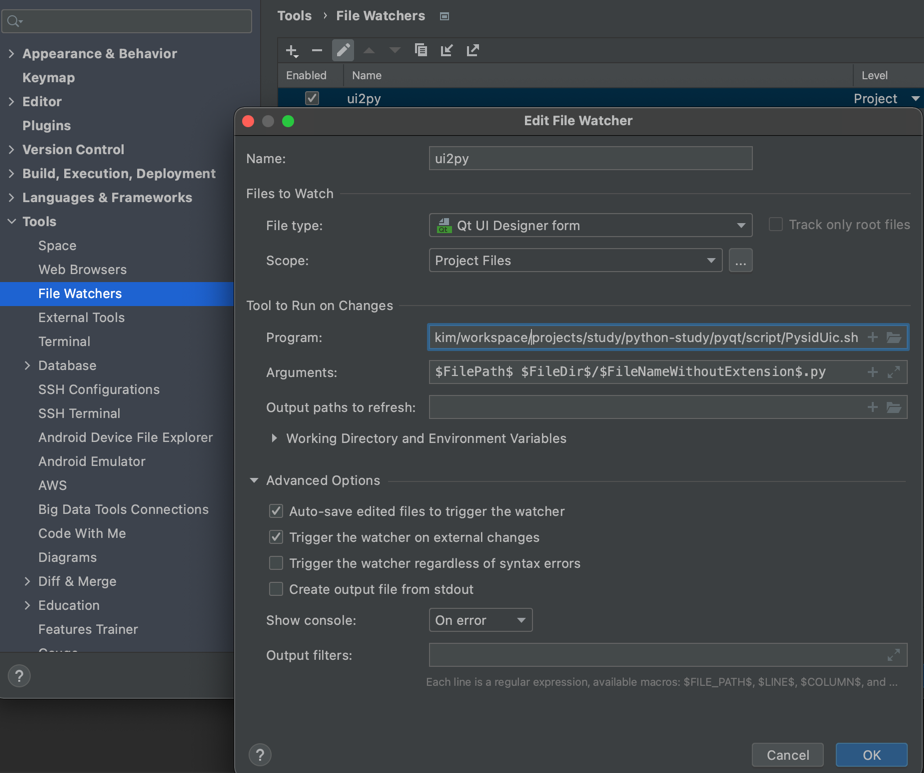

# PyQt5
- Can't use for commercial product for free(use PySide2 for free)


# PySide6
- free version of PyQt5
- https://wiki.qt.io/Qt_for_Python

# Qt products
- QML : 주로 cross-platform 용 인듯.. Qt Creator로 작업.
  - https://doc.qt.io/qtforpython/tutorials/index.html#quick-qml-basic-tutorials
  - https://doc.qt.io/qtforpython/tutorials/qmlapp/qmlapplication.html
  - https://doc.qt.io/qtforpython/tutorials/qmlsqlintegration/qmlsqlintegration.html

## Install

```shell
pip install PyQt6
pip install PySide6
```

## Qt Designer
- [Qt Designer Manual](https://doc.qt.io/qt-5/qtdesigner-manual.html)
```shell
pyside6-designer
pyside6-designer <file-path>
```

### Open Qt Designer on Intellij
#### open directly.
- configure intellij to open .ui file with external application.(settings -> File types)
- set .ui file to open [app](PysideDesigner.app)
- If you want to use File Watcher to create py file. this can't be used.
#### open with External tools
- configure external tools with PysideDesigner.app
- open with external tools

### Loading ui file
https://doc.qt.io/qtforpython/tutorials/basictutorial/uifiles.html
### using uic
- create python file from ui file
- able to recognize id of each widget
- inconvenient to create python file whenever ui changed.(maybe run some code which create python file whenever ui file is changed)
#### Create Python file from ui file automatically(on intellij)
- install File Watcher plugin
- settings -> tools -> File Watcher -> add config like the below

- make [PysideUic.sh](script/PysidUic.sh) executable with `chmod +x PysideUic.sh`
- test with External Tools

### using QUiLoader
- load ui file dynamically on runtime
- it's little slow because it takes time to parse ui file
- not able to recognize id of each widget

## Qt Resource System
- [ ] https://doc.qt.io/qt-5/resources.html
- [ ] https://doc.qt.io/qtforpython/tutorials/basictutorial/qrcfiles.html

## Qt Internationalization
- [ ] https://wiki.qt.io/PySide_Internationalization

## Qt Architecture
- [ ] [MVC](https://doc.qt.io/qt-6/model-view-programming.html)


## Python binaries
- pyside6-rcc : resource system
- pyside6-uic : generate python file
- pyside6-lupdate : Internationalization
- pyside6-designer : designer

## Official Reference for PySide
- [x] [Documents](https://doc.qt.io/qtforpython/)
  - [x] [QuickStart](https://doc.qt.io/qtforpython/quickstart.html)
  - [x] [Tuorial](https://doc.qt.io/qtforpython/tutorials/index.html)
  - [ ] [Deployment](https://doc.qt.io/qtforpython/deployment.html#deployment-guides)
  - [ ] [Deployment2](https://www.mfitzp.com/tutorials/packaging-pyqt5-pyside2-applications-windows-pyinstaller/)
- [ ] [Example](https://doc.qt.io/qtforpython/examples/index.html)
- [ ] [Example2](https://code.qt.io/cgit/pyside/pyside-setup.git/tree/examples)


## Reference
- [x] [PyQt6, PySide6 Difference](https://www.mfitzp.com/blog/pyqt6-vs-pyside6/)
- [ ] [tutorial3](https://www.mfitzp.com/courses/pyqt/)
- [ ] [examples](https://github.com/pyqt/examples)
- [ ] [examples2](https://github.com/learnpyqt/15-minute-apps)

## Paid Reference
- [ ] [Qt Creator](https://doc.qt.io/qtcreator/index.html)
  - this seems paid tool
  - [ ] [Qt Creator - tutorial](https://doc.qt.io/qtcreator/creator-tutorials.ht)
  - [ ] [Qt Designer](https://doc.qt.io/qtcreator/creator-using-qt-designer.html)

## Korean Reference
- [ ] [Tutorial for PyQt5](https://wikidocs.net/37456)
- [ ] [tutorial for PySide2](https://wikidocs.net/35742)

## Outdated Reference
- [x] [PyQt5 tutorial](https://build-system.fman.io/pyqt5-tutorial)
  - use fbs, pyqt5
- [ ] [tutorial2](https://coderslegacy.com/python/pyqt5-tutorial/)